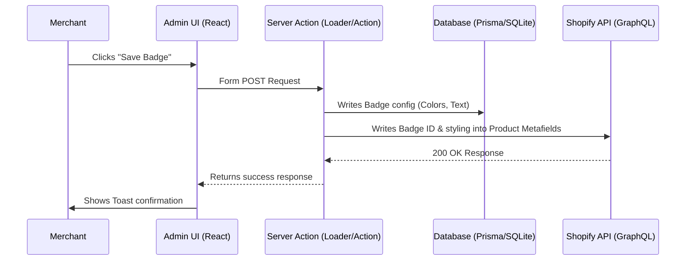

# System Architecture & Codebase Structure

This document outlines how the **BadgeCraft** codebase is organized, how data flows through the application, and how our backend interacts with the Shopify platform.

---

## 1. Project Directory Structure

Here is a simplified directory map of our workspace:

```text
learnify/
├── app/                       # The core React Router v7 application
│   ├── routes/                # File-system routes (endpoints and pages)
│   │   ├── _index/            # Marketing/landing page
│   │   ├── app._index.tsx     # The embedded merchant dashboard (home)
│   │   ├── app.tsx            # Main layout wrapper inside Shopify Admin
│   │   ├── auth.$.tsx         # Authentication routing (OAuth)
│   │   └── webhooks.tsx       # Event handlers (app uninstall, scope updates)
│   ├── db.server.ts           # Reusable Prisma database connection
│   ├── entry.server.tsx       # Entry point for Server-Side Rendering (SSR)
│   ├── root.tsx               # Root React component layout
│   ├── routes.ts              # Route declarations
│   └── shopify.server.ts      # Instantiates the Shopify App SDK helper functions
├── extensions/                # Front-end injection widgets (App Blocks)
│   └── (created in Phase 4)   # Liquid / CSS / JS code for storefronts
├── prisma/                    # Database ORM configuration
│   ├── dev.sqlite             # Local SQLite database (git-ignored)
│   └── schema.prisma          # Database schema models
├── public/                    # Static assets
├── shopify.app.toml           # App metadata, scopes, and subscription configs
└── shopify.web.toml           # Developer CLI instructions (how to run server)
```

---

## 2. Core Concepts & Data Flow

### A. Authentication & Session Flow
1. A merchant installs the app.
2. Shopify triggers an OAuth sequence handled by `app/routes/auth.$.tsx`.
3. `app/shopify.server.ts` handles the credentials, requests access tokens, and creates a session.
4. Prisma writes the session token and store details into `prisma/dev.sqlite`.
5. Any subsequent request to paths starting with `/app` executes `authenticate.admin(request)` in `app/routes/app.tsx` to verify the merchant's identity.

### B. Admin UI to Shopify API Flow (Prisma + GraphQL)


### C. Storefront Rendering Flow (No Database Querying)
1. A shopper visits the product page on the store.
2. Shopify's server processes the page request.
3. The **Theme App Extension** reads the product's metafield (`product.metafields.app.badge.value`) directly in Liquid.
4. Shopify renders the HTML containing the badge on its servers and delivers it to the customer.
5. **No database lookup or external API call is made from our app server during page load.** This ensures the shop loads at lightning speed.

## 3. Database Models

We use Prisma ORM connected to a local SQLite database for administration configuration:

* **`Badge`**: Holds styling values (colors, text) for each badge configuration created by a merchant.
* **`BadgeProduct`**: Join table mapping which Shopify product IDs receive which badge styles.

```prisma
model Badge {
  id              String         @id @default(uuid())
  shop            String         // Multi-tenant check
  text            String         // Display label
  textColor       String         @default("#FFFFFF")
  backgroundColor String         @default("#000000")
  createdAt       DateTime       @default(now())
  updatedAt       DateTime       @updatedAt
  products        BadgeProduct[]
}

model BadgeProduct {
  id        String   @id @default(uuid())
  badgeId   String
  productId String   // e.g. "gid://shopify/Product/12345678"
  badge     Badge    @relation(fields: [badgeId], references: [id], onDelete: Cascade)
  createdAt DateTime @default(now())

  @@unique([badgeId, productId])
}
```

---

## 4. Loader & Action Operations in Dashboard

Our home dashboard ([app._index.tsx](file:///G:/All%20Projects/Current%20Projects/Learnify/learnify/app/routes/app._index.tsx)) is decoupled into server operations and client UI:

### A. The Loader (Server-side)
Before the dashboard renders, the loader:
1. Authenticates the session using `authenticate.admin(request)`.
2. Queries the local Prisma database for existing badges configured for the current shop.
3. Sends a GraphQL query to the Shopify Admin API fetching the store's product catalog (IDs, titles, and images):
   ```graphql
   query getProducts {
     products(first: 50) {
       edges {
         node {
           id
           title
           handle
           featuredImage { url }
         }
       }
     }
   }
   ```
4. Feeds this data to the React frontend.

### B. The Action (Server-side)
* **`actionType === "create"`**: Reads form fields, creates the database record for the new badge, and maps the selected product associations in the join table.
* **`actionType === "delete"`**: Deletes the badge by ID, cascades to clear all related mappings.

---

## 5. TypeScript Integration for Shopify Web Components

Shopify App Bridge v4 introduces lightweight HTML custom elements prefixed with `s-` (e.g., `<s-page>`, `<s-button>`). Out of the box, standard TypeScript JSX definitions do not recognize these custom elements, leading to compilation failures.

To resolve this, we augmented the JSX global namespace inside [app/globals.d.ts](file:///G:/All%20Projects/Current%20Projects/Learnify/learnify/app/globals.d.ts):

```typescript
declare module "*.css";

declare global {
  namespace JSX {
    interface IntrinsicElements {
      's-page': any;
      's-button': any;
      's-section': any;
      's-paragraph': any;
      's-stack': any;
      's-box': any;
      's-heading': any;
      's-unordered-list': any;
      's-list-item': any;
      's-link': any;
      's-text-field': any;
      's-app-nav': any;
      's-text': any;
      's-link-item': any;
    }
  }
}

export {};
```

This maps the custom elements to TypeScript's JSX registry and allows compiling the project using `npm run typecheck` successfully.

