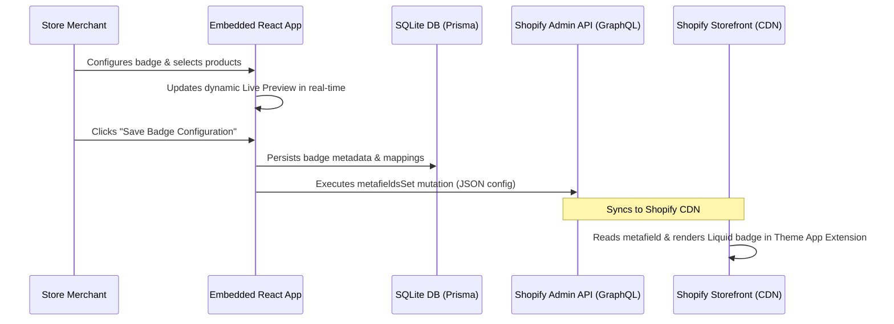

# BadgeCraft Technical Documentation & Architecture Summary

This document provides a comprehensive technical breakdown of all architectural designs, implementation choices, and code configurations implemented in the **BadgeCraft** Shopify application since the initial commit.

---

## 1. Project Objective & Architecture Overview

**BadgeCraft** is a modern, high-performance Shopify application built using **React Router v7** and **Shopify App Bridge v4** as an embedded app. It allows merchants to design custom promotional badges (e.g. "NEW ITEM", "50% OFF") and assign them to specific store products.

To guarantee store page-load speeds are unaffected by database queries, BadgeCraft separates its management storage from its storefront delivery:
1. **Management (Local SQLite Database):** Stores full badge details and product associations for the merchant administration panel.
2. **Storefront (Shopify Metafields):** Syncs active badge styling and text into Shopify's database as a Product Metafield (`product.metafields.app.badge_config.value`).
3. **Storefront Delivery (Theme App Extension):** A Liquid theme block reads the metafield and renders the badge server-side on Shopify's CDN, resulting in a database-free, zero-latency rendering process for shoppers.



---

## 2. Database Schema Configuration

We use **Prisma ORM** with an SQLite database file for local development. The database schema has been expanded with two primary models to track configuration state.

File Reference: [prisma/schema.prisma](file:///g:/All%20Projects/Current%20Projects/Learnify/learnify/prisma/schema.prisma)

```prisma
model Badge {
  id              String         @id @default(uuid())
  shop            String         // Identifies which Shopify store owns this badge configuration
  text            String         // Display text (e.g. "20% OFF")
  textColor       String         @default("#FFFFFF") // Hex value for font color
  backgroundColor String         @default("#000000") // Hex value for background
  createdAt       DateTime       @default(now())
  updatedAt       DateTime       @updatedAt
  products        BadgeProduct[] // One-to-many relationship with mapped products
}

model BadgeProduct {
  id        String   @id @default(uuid())
  badgeId   String
  productId String   // Shopify GraphQL Product ID (e.g. "gid://shopify/Product/123456789")
  badge     Badge    @relation(fields: [badgeId], references: [id], onDelete: Cascade)
  createdAt DateTime @default(now())

  @@unique([badgeId, productId]) // A single product cannot have the same badge applied twice
}
```

* **Cascade Deletes:** When a `Badge` is deleted, all referenced records in `BadgeProduct` are automatically removed from the database via Prisma's `onDelete: Cascade` rule.

---

## 3. Shopify Integration & Declarative Configs

### A. Declaring Storefront Metafields
In order for storefront app blocks to read badge configurations, we configured a public JSON-type metafield under the `$app` namespace in `shopify.app.toml`.

File Reference: [shopify.app.toml](file:///g:/All%20Projects/Current%20Projects/Learnify/learnify/shopify.app.toml#L37-L45)

```toml
[product.metafields.app.badge_config]
type = "json"
name = "Badge Configuration"
description = "Badge text, textColor, and backgroundColor configuration for storefront display"

  [product.metafields.app.badge_config.access]
  admin = "merchant_read_write"
  storefront = "public_read"
```

* Setting `storefront = "public_read"` allows the public-facing storefront Theme App Extension blocks to read this field directly.

### B. GraphQL Operations (Admin API Integration)
To maintain code separation and testability, all database queries and Shopify GraphQL API communications are encapsulated inside the backend service module: [badgecraft.server.ts](file:///g:/All%20Projects/Current%20Projects/Learnify/learnify/app/services/badgecraft.server.ts). The index route [app/routes/app._index.tsx](file:///g:/All%20Projects/Current%20Projects/Learnify/learnify/app/routes/app._index.tsx) acts as a clean controller delegating requests directly to this service:

1. **Loader Product Querying:**
   Queries the store's product catalog (up to 50 items) for displaying in the dashboard product selector:
   ```graphql
   query getProducts {
     products(first: 50) {
       edges {
         node {
           id
           title
           handle
           featuredImage {
             url
           }
         }
       }
     }
   }
   ```

2. **Badge Creation Sync (`metafieldsSet`):**
   When a badge is saved, a single batch mutation is sent to Shopify to assign the design configuration to the designated products:
   ```graphql
   mutation setMetafields($metafields: [MetafieldsSetInput!]!) {
     metafieldsSet(metafields: $metafields) {
       metafields {
         id
       }
       userErrors {
         field
         message
       }
     }
   }
   ```

3. **Badge Deletion Sync (`metafieldsDelete`):**
   To delete badges, we utilize Shopify's modern `metafieldsDelete` API, taking an array of `{ ownerId, namespace, key }` to clean up all product configurations in one round-trip:
   ```graphql
   mutation deleteMetafields($metafields: [MetafieldIdentifierInput!]!) {
     metafieldsDelete(metafields: $metafields) {
       deletedMetafields {
         key
         namespace
         ownerId
       }
       userErrors {
         field
         message
       }
     }
   }
   ```

---

## 4. Frontend Architecture & Design System

The application layout is built using native **Shopify Polaris Custom Web Components** styled with official design tokens. The project utilizes native spacing, alignment, and border attributes (e.g. `padding`, `background`, `borderStyle`, `borderWidth`, `borderColor`, `borderRadius`, and `gap`) directly on custom elements such as `<s-box>`, `<s-grid>`, `<s-stack>`, and `<s-heading>` to guarantee layout consistency with Shopify's default administration styling. Custom stylesheet overrides [app/styles/badgecraft.css](file:///g:/All%20Projects/Current%20Projects/Learnify/learnify/app/styles/badgecraft.css) are reserved exclusively for mock storefront render styles and inputs.

To maintain clean and highly readable code, all UI components have been refactored out of the main index route and into a modular, reusable component library: [BadgeCraftComponents.tsx](file:///g:/All%20Projects/Current%20Projects/Learnify/learnify/app/components/BadgeCraftComponents.tsx).

### Key Frontend Components & Features:
* **BadgeBuilder (`BadgeBuilder` Component):** Form component that maps user inputs (text label, text color picker, and background color picker) and wraps the product selection layout.
* **ProductSelector (`ProductSelector` Component):** Scroll-based product selection container that includes native list item rows, checkboxes, and inline search queries that filter Shopify catalog products instantly.
* **LivePreview (`LivePreview` Component):** Implements a real-time reactive card that renders the badge styling changes (text, background color, text color) instantly using React states (`badgeText`, `textColor`, `bgColor`) as the merchant types or picks colors. Styled natively using a combination of vertical `<s-box>` layouts and `<s-heading>` titles.
* **ActiveBadgesList (`ActiveBadgesList` Component):** Displays a table of all created configurations, showing styled previews of the badge, hex codes, and list tags of all assigned products inside a native `<s-box>` surface card.
* **DeleteConfirmModal (`DeleteConfirmModal` Component):** Integrated the native `<ui-modal>` and `<ui-title-bar>` App Bridge components for deletion confirmations to provide a native browser modal experience when cleaning configurations.

### App Bridge Web Component Type Definitions
Shopify App Bridge v4 introduces custom HTML elements (`s-page`, `s-section`, etc.) that throw TypeScript JSX exceptions by default. To make the project compilation and linting clean, custom elements are registered in a global namespace declare file. This includes standard input custom elements like `s-text-field` and `s-search-field` to handle styling and accessibility natively within the Shopify admin theme.

File Reference: [app/globals.d.ts](file:///g:/All%20Projects/Current%20Projects/Learnify/learnify/app/globals.d.ts)

```typescript
declare module "*.css";

import * as React from 'react';

declare module 'react' {
  namespace JSX {
    interface IntrinsicElements {
      's-page': any;
      's-button': any;
      's-section': any;
      's-paragraph': any;
      's-stack': any;
      's-box': any;
      's-heading': any;
      's-unordered-list': any;
      's-list-item': any;
      's-link': any;
      's-text-field': any;
      's-search-field': any;
      's-app-nav': any;
      's-text': any;
      's-link-item': any;
      'ui-modal': any;
      'ui-title-bar': any;
      's-grid': any;
      's-grid-item': any;
    }
  }
}
```

---

## 5. Theme App Extension Storefront Rendering

The customer-facing storefront badge is rendered through a Shopify **Theme App Extension** named `product-badge-block`.

File Reference: [extensions/product-badge-block/blocks/badge.liquid](file:///g:/All%20Projects/Current%20Projects/Learnify/learnify/extensions/product-badge-block/blocks/badge.liquid)

```liquid

  
  
    <div class="badgecraft-storefront-badge" style="
      background-color: {{ badge.backgroundColor | default: '#000000' }};
      color: {{ badge.textColor | default: '#ffffff' }};
      padding: 6px 12px;
      font-size: 14px;
      font-weight: 700;
      border-radius: 12px;
      display: inline-block;
      margin: 8px 0;
      box-shadow: 0 2px 4px rgba(0,0,0,0.1);
      font-family: inherit;
    ">
      {{ badge.text }}
    </div>
  



{
  "name": "Product Badge Block",
  "target": "section",
  "settings": [
    { "type": "product", "id": "product", "label": "Product", "autofill": true }
  ]
}

```

### Highlights:
1. **Dynamic Styling:** Inline styling dynamically binds background color (`badge.backgroundColor`) and text color (`badge.textColor`) based on values synced from the backend dashboard.
2. **Server-Side Verification:** Checks `product.metafields.app.badge_config.value` exists and has non-empty text before rendering any HTML element, preventing blank container space if no badge is active.
3. **Seamless Integration:** Uses standard Shopify schema settings to enable merchants to position the badge anywhere within their product page layout directly inside the Shopify Theme Editor.
